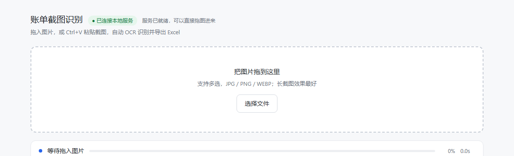
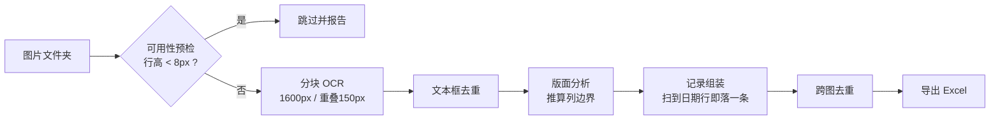

# 账单长截图 OCR → Excel

把微信 / 支付宝的**账单长截图**自动识别成结构化 Excel 表格。支持批量处理与网页界面。

**全程本地离线运行** —— 使用本地 OCR 模型，图片不上传任何服务器，断网也能用。

[](https://github.com/Dsimpson-man/bill-screenshot-ocr/releases/latest)
[](https://www.python.org/)
[]()
[]()
[](LICENSE)



---

> ### ⬇️ 不想装 Python？
> 直接下载免安装版：**[Releases · 下载 zip](https://github.com/Dsimpson-man/bill-screenshot-ocr/releases/latest)**
>
> 解压 → 双击 `启动.bat` → 浏览器自动打开。内置 OCR 模型，**不用装环境、不用联网**。适用于 Windows 10 / 11 64 位。

---

## 它解决什么问题

微信和支付宝的账单只能看到、不能导出。一张完整账单长截图通常有 **40000 像素高**、包含几百条记录，手动录入不现实。

但直接丢给通用 OCR 会失败。这个项目针对三个具体障碍做了处理：

| 障碍 | 实际现象 | 这里的做法 |
| :--- | :--- | :--- |
| **超长图检测失效** | 40366px 高的整图丢给 OCR，**只识别出 1 个文本框** | 纵向切成 1600px 一块、重叠 150px，逐块识别后按坐标拼回 |
| **图片被压缩** | 聊天软件转发的图，每行文字只剩 2~6px，怎么放大都是马赛克 | 开跑前先估算文字行高，**低于 8px 直接跳过**并写明原因 |
| **滚动截图互相重叠** | 同一笔账单出现在两张图里；但按内容去重会**误删真实的重复订单** | 按"特征在单张图内的出现次数取最大值"合并 |

## 特性

- **批量处理** —— 整个文件夹一次跑完，自动跳过不可用的图并生成原因报告
- **网页界面** —— 拖拽或 `Ctrl+V` 粘贴截图，实时进度条 + 阶段提示 + 耗时 + 剩余时间预估 + 运行日志
- **自适应版面** —— 列边界按图片宽度等比推算，不同手机、不同分辨率截图都不用改参数
- **可追溯** —— 明细表带「来源文件」列，每条记录都能查到来自哪张截图
- **免安装分发** —— 可打包成单个文件夹，对方电脑无需 Python、无需联网

## 快速开始

### 方式一：下载免安装版（适合非开发者）

到 **[Releases](https://github.com/Dsimpson-man/bill-screenshot-ocr/releases/latest)** 下载 `bill-screenshot-ocr-*-win64.zip`，解压后双击 `启动.bat`。

解压时请**保留整个文件夹** —— `账单截图识别工具/_internal/` 里是 Python 运行时和 OCR 模型，单独把 `exe` 拖出来无法运行。

### 方式二：源码运行（推荐给开发者）

```bash
git clone https://github.com/Dsimpson-man/bill-screenshot-ocr.git
cd bill-screenshot-ocr
```

**Windows** —— 双击 `setup.bat` 装依赖，之后双击 `run.bat` 启动，浏览器会自动打开。

**macOS / Linux**

```bash
python3 -m venv .venv
source .venv/bin/activate
pip install -r requirements.txt
python bill_ui/bill_ui.py       # 浏览器打开 http://127.0.0.1:8848
```

> 首次启动会自动下载 OCR 模型（约 15MB），之后完全离线。

### 方式二：命令行批量处理

适合已经有大量截图、不需要界面的场景：

```bash
python batch_ocr_bills.py "D:\账单截图"
python batch_ocr_bills.py "D:\账单截图" --recursive     # 含子文件夹
python batch_ocr_bills.py "D:\账单截图" --out "D:\结果.xlsx"
```

输出示例：

```
发现 12 张图片
============================================================
[1/12] IMG_001.jpg -> 1220x40366，最细文字行高约 36px；识别 127 条
[2/12] IMG_002.jpg -> 1220x21030，最细文字行高约 36px；识别 66 条
[3/12] 转发图.jpg  -> 跳过：分辨率不足 58x1920，最细文字行高约 2px（需 ≥8px）
...
跨图去重：移除 193 条重复（重叠截图）
============================================================
完成：193 条记录，合计 ¥7,384.02
时间范围：2025-11-28 00:51 ~ 2025-12-04 14:11
跳过/失败 1 个文件
```

### 方式四：打包成免安装程序

```bash
pip install pyinstaller
python build_package.py
```

产物在 `dist_pkg/账单截图识别工具/`（约 230MB，含 OCR 模型）。把 `dist_template/` 里的 `启动.bat` 和 `使用说明.txt` 放在同级目录，整个文件夹压缩后即可发给别人 —— **对方电脑不需要安装 Python，也不需要联网**。

打包完成后的成品发布在 [Releases](https://github.com/Dsimpson-man/bill-screenshot-ocr/releases)，供不想装环境的人直接下载。

## 输出格式

Excel 包含 4 个工作表：

| 工作表 | 内容 |
| :--- | :--- |
| **交易明细** | 序号 / 交易时间 / 类型 / 商户名称 / 商品说明 / 金额(元) / 优惠备注 / 来源文件<br>已冻结首行 + 自动筛选，金额负值红色显示 |
| **商户汇总** | 按商户统计笔数与金额合计 |
| **月度汇总** | 按月统计笔数、支出合计、退款笔数 |
| **处理报告** | 被跳过或失败的文件，以及具体原因 |

## 工作原理



详细的算法说明、参数含义和踩过的 8 个坑，见 **[docs/工作原理.md](docs/工作原理.md)**。

## 常见问题

**Q：双击「启动.bat」窗口一闪就没了，或提示「找不到程序文件」？**
最可能是没解压就直接运行了。请先把压缩包**完整解压**成文件夹，再进文件夹双击 `启动.bat` —— 在压缩包窗口里直接双击会失败，单独把 `启动.bat` 拖出来也不行，它必须和「账单截图识别工具」文件夹同级。

**Q：浏览器没有自动打开？**
打开浏览器手动输入 `http://127.0.0.1:8848` 即可，功能完全一样。程序启动时也会逐级尝试 `webbrowser` → 系统默认程序 → `start` 命令三种方式唤起，并把结果打印到窗口里；如果三种都失败（通常是没设置默认浏览器，或默认浏览器是绿色版/便携版），手动访问即可。

**Q：拖图进网页没反应？**
先看页面左上角是否显示「● 已连接本地服务」。如果是红色的「未连接」，说明浏览器打开的时机早于服务启动 —— 等 10 秒刷新即可。也可以直接用 `Ctrl+V` 粘贴截图，或点「选择文件」按钮。

**Q：提示「分辨率不足」怎么办？**
这张图被压缩得太厉害。请换成原图：从手机相册里选**原图**发送，不要用聊天软件转发压缩。经验上，图片宽度低于 500px 基本无解。

**Q：识别出来的字有错？**
金额和时间这类关键信息基本不会错。长截图**边缘被截断**的位置可能导致个别字偏差；商品名末尾的省略号是截图本身截断的，无法还原。常见的识别错字可以在 `batch_ocr_bills.py` 的 `FIX` 字典里加修正对照。

**Q：处理速度？**
单张 1220×40366 的超长图约 **25~50 秒**（取决于 CPU），因为要跑约 28 次分块推理。界面会实时显示进度和预计剩余时间。

**Q：能用在别的 App 的账单上吗？**
目前只适配微信/支付宝的账单版式。其他应用的账单结构不同，需要修改 `parse_records()` 里的解析规则。

**Q：关掉服务窗口会不会丢结果？**
已下载的 Excel 不受影响，「识别结果」文件夹里的文件也会保留。但服务窗口（黑色命令行窗口）关掉后网页就失效了，需要重新启动。

## 隐私说明

账单截图包含完整的消费记录，这个工具在设计上就没有任何网络上传：

- OCR 使用 **rapidocr-onnxruntime** 本地推理，模型随包分发，运行时不联网
- Web 服务只监听 `127.0.0.1`（本机回环地址），**局域网内其他设备也访问不到**
- 没有任何统计、埋点或遥测
- `.gitignore` 已排除所有 `*.xlsx` / 识别结果目录，避免账单数据被误提交

## 项目结构

```
bill-screenshot-ocr/
├── batch_ocr_bills.py        # 核心：OCR + 解析 + 导出（命令行批量）
├── bill_ui/
│   ├── bill_ui.py            # Flask 网页界面（复用上面所有逻辑）
│   └── index.html            # 前端，零依赖、无 CDN
├── build_package.py          # 打包成免安装 exe
├── setup.bat / run.bat       # Windows 一键装环境 / 一键启动
├── dist_template/            # 分发时随 exe 一起发出的启动脚本与说明
│   ├── 启动.bat
│   └── 使用说明.txt
└── docs/
    ├── 工作原理.md            # 算法细节与坑位清单
    └── ui-preview.png
```

## 技术栈

`Pillow` 图片处理 · `rapidocr-onnxruntime` 本地中文 OCR · `openpyxl` 生成 Excel · `Flask` 网页界面 · `PyInstaller` 打包

无任何前端框架或 CDN 依赖（`index.html` 是单文件原生 JS）。

## 开发者须知：`.bat` 的编码

`setup.bat` / `run.bat` / `dist_template/启动.bat` **必须保存为 GBK(cp936) 编码 + CRLF 换行**，并且**不要用 `chcp 65001`**。

这不是风格偏好，是踩过的坑：

| 写法 | 后果 |
| :--- | :--- |
| UTF-8 无 BOM | 中文 Windows 的 cmd.exe 按 ANSI(936) 读取 → 中文全乱码，中文路径 `cd` 直接失败 |
| 加 `chcp 65001` | cmd 在读取过程中切换代码页会**解析错位**，脚本只执行一部分 |
| LF 换行 | cmd 解析同样错位（实测报错 `'cho' 不是内部或外部命令`），**exe 根本不会被调用** |

所以启动脚本的**逻辑部分刻意不含中文**：不写死中文目录名，改为按 `_internal` 标记自动定位 exe。这样即使系统码页不是 936，也只是窗口里的提示文字变乱码，程序照样能起来。

改了 `.bat` 之后一定要实机双击验证一遍（或在控制台 `cmd /c 启动.bat` 跑一次）。

## 已知局限

- 只适配微信/支付宝账单长截图版式，其他 App 需改解析规则
- 商品说明被截图本身截断的内容无法还原
- 识别质量依赖原图分辨率，压缩过的图会被直接拒绝
- 网页界面目前只在 Windows 上做了启动脚本，macOS / Linux 请手动执行 `python bill_ui/bill_ui.py`

## 许可证

[MIT](LICENSE)
