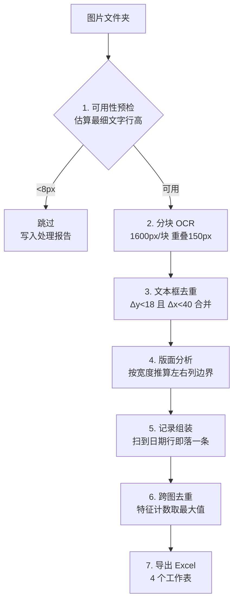

# 工作原理

这份文档记录整套流程的设计取舍，以及开发过程中踩过的坑。想改代码前建议先看一遍。

## 整体流程



## 1. 可用性预检（`check_readable`）

**先验货再动手**，这是整个设计里最省时间的一步。

做法：灰度化后统计每行的暗色像素数（阈值 160），连续暗行构成一个"文字行"，取这些行高的**最小值**。

```python
dark = (a < 160).sum(axis=1)     # 每行有多少暗像素
heights = [r for r in rows if 2 <= r <= 60]
mh = min(heights) if heights else 999
if w < 200 or mh < MIN_TEXT_LINE_H:   # MIN_TEXT_LINE_H = 8
    跳过
```

**为什么用最小值而不是平均值**：账单列表里商品说明的字号最小，最容易糊。用最小值等于按最坏情况判断。

**为什么是 8px**：实测汉字在低于 8px 时，笔画之间的空隙消失，人眼和模型都无解。一张被聊天软件压缩过的转账截图，文字行高往往只剩 2~6px —— 这种图跑 OCR 只会浪费时间并产出垃圾结果。

## 2. 分块 OCR（`ocr_image`）

**问题**：一张 1220×40366 的整图直接丢给检测模型，实测只输出 **1 个文本框**。因为检测器内部的输入尺寸被压缩后，文字全部小于可检测下限。

**做法**：纵向切块，每块 `CHUNK_H = 1600` px，相邻块重叠 `OVERLAP = 150` px。

```python
y = 0
while y < h:
    y1 = min(h, y + CHUNK_H)
    res, _ = engine(np.array(im.crop((0, y, w, y1))))
    # 把块内坐标加上 y 偏移，还原成原图绝对坐标
    y = y1 - OVERLAP
```

**重叠为什么必需**：刚好切在文字行中间时，两块都识别不出那行。150px 的重叠保证每个文字行至少在某一块里是完整的。

**代价**：重叠区域的文字会被识别两次，所以必须去重（下一步）。

## 3. 文本框去重（`dedupe_boxes`）

```python
if abs(L['y'] - b['y']) < 18 and abs(L['x0'] - b['x0']) < 40:
    保留 score 更高的那条
```

阈值 `18px / 40px` 是经验值：小于它认为是同一个框的两次识别，大于它认为是两个不同的框。

## 4. 版面分析（`detect_columns`）

账单卡片的固定结构是「左：头像 + 商户名 / 中：时间 + 商品说明 / 右：金额」。

不能写死像素坐标 —— 不同手机、不同分辨率截出来的图宽度不一样。做法是把基准图（1220px 宽）的边界按比例缩放：

```python
scale = width / REF_WIDTH          # REF_WIDTH = 1220
left  = REF_LEFT  * scale          # REF_LEFT  = 190  头像列右边界
right = REF_RIGHT * scale          # REF_RIGHT = 930  金额列左边界

# 再用实际检测到的金额位置校正右边界
amt_x = [L['x0'] for L in lines if AMT.match(L['text'].strip())]
if len(amt_x) >= 5:
    right = max(min(amt_x) - 0.02 * width, width * 0.5)
```

`x0 < left` 是头像上的水印文字（"嵊泗""新华書店"之类），直接丢；`x0 > right` 是金额列。

## 5. 记录组装（`parse_records`）

核心规则：**账单卡片以"日期行"结尾**。

按 y 从上到下扫描，每行按正则归类：

| 类型 | 正则 | 处理 |
|---|---|---|
| 月份标题 | `^(\d{4})年(\d{1,2})月` | 更新当前 year/month |
| 收支小结 | `^(收入\|支出)[￥¥]` | 丢弃（页面顶部的统计，不是明细） |
| 日期 | `^(\d{1,2})月(\d{1,2})日\s?(\d{1,2}):(\d{2})$` | **flush 上一条**，开新记录 |
| 残缺日期 | `^(\d{1,2})0?(\d{2}):(\d{2})$` | 截图截断导致，用上一条的月份回填 |
| 金额 | `^[-+]\s?([\d,]+\.\d{2})$` | 记为 amt |
| 其他 | — | `已优惠` 开头记 note；否则第一个是商户，之后累加进商品说明 |

所以 **记录条数 = 日期行条数**，这是一个很好用的自校验指标。

## 6. 跨图去重（最容易做错的一步）

**最初的错误做法**：把 `(时间, 商户, 金额)` 相同的记录直接当重复删掉。

**结果**：丢了 20 条真实交易。原因是在同一分钟内向同一家店连下了 3 笔一模一样的订单（￥6.88 × 3），被误判成同一张截图里的重复检测。

**正确做法**：先统计每个特征在**单张图内**的出现次数，跨图时取**最大值**，然后按序发放。

```python
mult = defaultdict(int)
for _, rows in per_image:                       # 每张图内计数
    for k, v in Counter(key(r) for r in rows).items():
        mult[k] = max(mult[k], v)               # 跨图取最大出现次数

emitted = Counter()
for _, rows in per_image:                       # 按额度发放
    for r in rows:
        k = key(r)
        if emitted[k] < mult[k]:
            emitted[k] += 1
            all_rows.append(r)
```

效果：
- 重叠截图里的同一条 → 出现次数没有超过单张图内的最大次数 → 被剔除
- 真实的重复下单 → 单张图内就出现了 3 次 → 完整保留

## 7. 导出 Excel（`export`）

4 个工作表：

| 工作表 | 内容 |
|---|---|
| 交易明细 | 序号 / 交易时间 / 类型 / 商户名称 / 商品说明 / 金额 / 优惠备注 / **来源文件** |
| 商户汇总 | 按商户统计笔数与金额合计 |
| 月度汇总 | 按月统计笔数、支出合计、退款笔数 |
| 处理报告 | 被跳过或失败的文件及具体原因 |

明细表带「来源文件」列，任何一条都能追溯到是哪张截图识别出来的。

## 坑位清单

| 坑 | 现象 | 解法 |
|---|---|---|
| 超长图检测失效 | 40366px 整图只出 1 个框 | 分块 + 重叠 |
| 剪贴板降采样 | 从聊天窗口粘贴的图变成 58px 宽 | 预检拦截；找原始文件而不是救压缩图 |
| 日期捕获组写反 | 全部变成 `12-12` / `11-11` | 打印最大/最小日期做极值校验 |
| 右列低置信碎片 | 放大镜图标识别成 `070` 混进商户名 | `x0 >= right` 且不匹配金额正则的一律丢弃 |
| 截图截断末行 | 日期只剩 `2800:51` | 残缺日期正则 + 用上一条月份回填 |
| 内容去重误删 | 同分钟同店同额的真实订单被删 | 改成"计数取最大值" |
| 进度条算错 | 28 块算成 26 块，进度提前 100% | 块数按 `(CHUNK_H - OVERLAP)` 步长算，不是 `h / CHUNK_H` |
| exe 启动竞态 | 浏览器先于服务打开，页面打不开 | 由程序轮询 `/api/ping` 就绪后再开浏览器 |

## 已知局限

- **只适配微信/支付宝的账单长截图版式**。其他 App 的账单结构不同，需要改 `parse_records` 的规则。
- **商品说明里被截图本身截断的内容会带省略号**，无法还原，需要更完整的截图。
- **金额与时间基本不会错，商户名和商品名可能有个别错字**。可以在 `FIX` 字典里加常见的识别修正对照。
- 单张 1220×40366 的图约需 **25~50 秒**（取决于 CPU），因为要跑 28 次分块推理。
